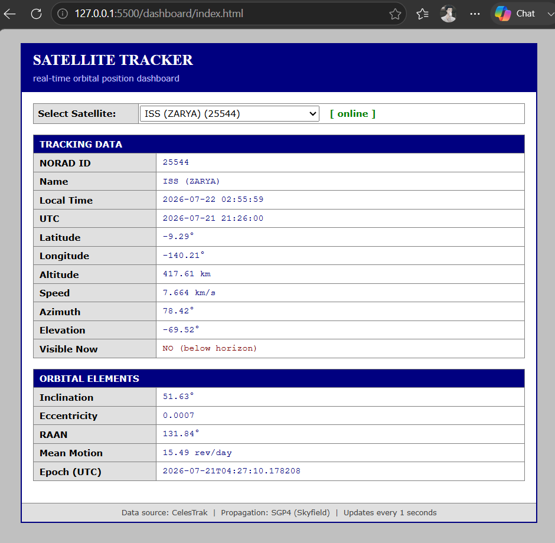

# Satellite Position Tracker

A self-hosted dashboard that tracks any active satellite in real time — live position, orbital elements, and pointing angles — computed locally using SGP4 orbital propagation.



## Features

- Live tracking for any satellite in a selectable Celestrak group (ISS, Tiangong, and more)
- Real-time latitude/longitude/altitude/speed, updated every 2 seconds
- Azimuth/Elevation relative to a fixed ground location
- Raw orbital elements (inclination, eccentricity, RAAN, mean motion, epoch)
- Automatic TLE caching and refresh, respecting Celestrak's fair-use limits

## How it works

The backend fetches orbital element sets (TLEs) from [Celestrak](https://celestrak.org) and caches them locally, refreshing only every few hours since the underlying data doesn't change more often than that. When the dashboard requests a satellite, the backend runs **SGP4 propagation** (via the [Skyfield](https://rhodesmill.org/skyfield/) library) to compute that satellite's current position, then converts it into observer-relative pointing angles (azimuth/elevation) for a fixed ground location. This is all exposed through a small **Flask REST API**, which a plain HTML/JS dashboard polls every couple of seconds to display live, continuously updating tracking data.

```
Celestrak (TLE data)
        │
        ▼
  Backend (Python + Skyfield)
   - fetch & cache TLEs
   - SGP4 propagation
   - Az/El calculation
        │
        ▼
  REST API (Flask)
        │
        ▼
  Dashboard (HTML/CSS/JS)
   - satellite picker
   - live stats
```

## Tech stack

- **Backend:** Python, Flask, Skyfield (SGP4 propagation)
- **Data source:** Celestrak (TLE / orbital element sets)
- **Frontend:** Plain HTML, CSS, JavaScript (no build step required)

## Project structure

```
satellite-tracker/
├── backend/
│   ├── app.py                  # Flask server entry point
│   ├── config.py               # Observer location + settings
│   ├── requirements.txt
│   ├── tle/
│   │   └── fetcher.py          # Fetches & caches TLE data from Celestrak
│   ├── tracking/
│   │   ├── propagator.py       # SGP4 propagation (geocentric position)
│   │   └── topocentric.py      # Az/El, speed, and other observer-relative data
│   └── api/
│       └── routes.py           # /satellites and /track endpoints
│
├── dashboard/
│   ├── index.html
│   ├── style.css
│   └── script.js
│
├── docs/
│   └── screenshots/             # Put dashboard screenshots here (see below)
│
├── requirements.txt
├── LICENSE
└── README.md
```

## Getting started

### Prerequisites
- Python 3.9 or later
- pip

### 1. Clone the repository
```bash
git clone https://github.com/utkarsh094/satellite-tracker
cd satellite-tracker
```

### 2. Set up a virtual environment
```bash
python3 -m venv venv
source venv/bin/activate       # Windows: venv\Scripts\activate
```

### 3. Install dependencies
```bash
pip install -r backend/requirements.txt
```

### 4. Set your ground location
Open `backend/config.py` and update these values to your own coordinates:
```python
OBSERVER_LAT_DEG = 21.1458
OBSERVER_LON_DEG = 79.0882
OBSERVER_ELEVATION_M = 310
```

### 5. Run the backend
```bash
cd backend
python app.py
```
This starts the API at `http://localhost:8000`. Leave this terminal running.

### 6. Run the dashboard
In a **new** terminal:
```bash
cd dashboard
python -m http.server 5500
```
Then open **http://localhost:5500** in your browser.

You should see the dashboard load, the satellite dropdown populate automatically, and live tracking data begin updating every couple of seconds.

## Adding your own screenshot

1. Run the project locally (steps above) and get the dashboard looking the way you want, with a satellite selected and data populated.
2. Take a screenshot and save it as `docs/screenshots/dashboard.png` (create the `docs/screenshots/` folder if it doesn't exist).
3. Commit it like any other file:
   ```bash
   git add docs/screenshots/dashboard.png
   git commit -m "Add dashboard screenshot"
   git push
   ```
4. It'll automatically appear at the top of this README on GitHub, since the image is already referenced above.

## API reference

| Endpoint | Description |
|---|---|
| `GET /` | Health check |
| `GET /satellites` | List of trackable satellites in the current group |
| `GET /track?sat=<norad_id>` | Full live tracking data for one satellite |

## License

This project is licensed under the MIT License — see the [LICENSE](LICENSE) file for details.

## Acknowledgments

- Orbital data provided by [Celestrak](https://celestrak.org)
- Orbital propagation powered by [Skyfield](https://rhodesmill.org/skyfield/)