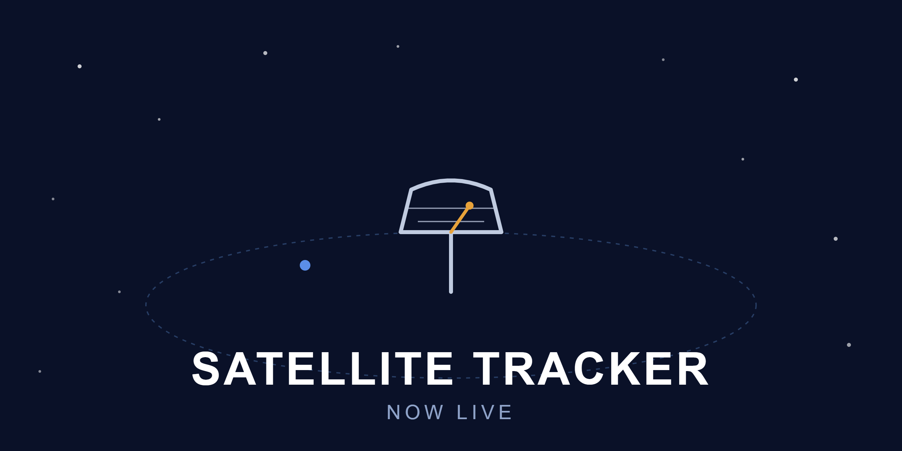

#  Satellite Tracker

A live, self-hosted dashboard that tracks any active satellite in real time. Pick a satellite and watch its position, speed, and orbital path update continuously — all computed locally with real orbital mechanics, not a third-party tracking API.

**Live** https://utkarsh094.github.io/satellite-tracker/



---

## What it does

- Tracks any satellite in a selectable [Celestrak](https://celestrak.org) group (ISS, Tiangong, and other active objects) in real time
- Computes live latitude, longitude, altitude, and orbital speed updated every couple of seconds
- Calculates Azimuth/Elevation relative to a fixed ground location, the same math a real antenna tracker would use to point at the sky
- Displays the satellite's raw orbital elements (inclination, eccentricity, RAAN, mean motion)
- Gracefully falls back to cached data if the upstream data source is temporarily unreachable, instead of failing outright

## How it works

Under the hood, this is a small full-stack system with a clear separation between orbital computation and presentation:

```
         Celestrak (orbital element data)
                       │
                       ▼
         Backend — Python, Flask, Skyfield
   • fetches & caches TLE data (respects Celestrak's refresh limits)
   • SGP4 propagation → real-time satellite position
   • converts geocentric position → observer-relative Az/El
                        │
                        ▼
        REST API (Flask, hosted on PythonAnywhere)
                        │
                        ▼
      Frontend — plain HTML/CSS/JS (hosted on GitHub Pages)
            • satellite picker, live stat panels

```

The backend fetches orbital element sets (TLEs) from Celestrak and caches them locally, since the underlying data itself only updates a few times a day — no need to hit the API more often than that. When a satellite is selected, the backend runs **SGP4 propagation** via the [Skyfield](https://rhodesmill.org/skyfield/) library to compute its exact position for the current moment, then converts that into azimuth/elevation relative to a fixed observer location. This is exposed through a small Flask REST API that the frontend polls every couple of seconds to keep the display live.

## Tech stack

| Layer | Technology |
|---|---|
| Orbital propagation | [Skyfield](https://rhodesmill.org/skyfield/) (SGP4) |
| Backend API | Python, Flask |
| Data source | [Celestrak](https://celestrak.org) GP/OMM data |
| Frontend | Plain HTML, CSS, JavaScript |
| Backend hosting | [PythonAnywhere](https://www.pythonanywhere.com) |
| Frontend hosting | [GitHub Pages](https://pages.github.com) |

## Hosting & deployment

<<<<<<< HEAD
The backend and frontend are deployed independently, on separate platforms, and communicate purely over a REST API:
=======
```
satellite-tracker/
├── backend/
│   ├── app.py                  # Flask server entry point
│   ├── config.py               # Observer location + settings
│   ├── requirements.txt
│   ├── tle/
│   │   └── fetcher.py          # Fetches & caches TLE data from Celestrak
│   ├── tracking/
│   │   ├── propagator.py       # SGP4 propagation (geocentric position)
│   │   └── topocentric.py      # Az/El, speed, and other observer-relative data
│   └── api/
│       └── routes.py           # /satellites and /track endpoints
│
├── docs/
│   ├── index.html
│   ├── style.css
│   └── script.js
│   └── screenshots/             # Put dashboard screenshots here (see below)
│
├── requirements.txt
├── LICENSE
└── README.md
```
>>>>>>> fe069f510c25d49f2be892c045746e92cd86df4b

- **Backend** runs on PythonAnywhere, chosen specifically because its free tier stays continuously running (**no cold-start sleep**), which matters for a dashboard people might check at any time of day.
- **Frontend** is static and deploys automatically from this repo via GitHub Pages on every push to `main`.
- **CORS** is explicitly restricted on the backend to only accept requests from the deployed frontend's origin, not left open to any site.
- Backend updates are deployed manually (`git pull` + reload on PythonAnywhere) rather than auto-deployed, since the platform's free tier doesn't support push-to-deploy a deliberate tradeoff in exchange for reliable always-on hosting.

## A few technical details worth knowing

<<<<<<< HEAD
- **Why not just call a live tracking API?** The orbital math (SGP4 propagation) is done directly in this project rather than proxying another tracking service — the backend only depends on Celestrak for the raw orbital elements themselves, everything else (position, Az/El, orbit shape) is computed locally.
- **Type safety across the Python↔JSON boundary:** Skyfield's underlying numeric types (NumPy floats/booleans) aren't natively JSON-serializable, so every value returned by the API is explicitly cast to a native Python type before being sent to the frontend.
- **Resilience:** if Celestrak is temporarily unreachable, the backend falls back to the most recent successfully cached data rather than returning an error, so a brief upstream outage doesn't take the dashboard down with it.
=======
### 1. Clone the repository
```bash
git clone https://github.com/utkarsh094/satellite-tracker
cd satellite-tracker
```

### 2. Set up a virtual environment
```bash
python3 -m venv venv
source venv/bin/activate       # Windows: venv\Scripts\activate
```

### 3. Install dependencies
```bash
pip install -r backend/requirements.txt
```

### 4. Set your ground location
Open `backend/config.py` and update these values to your own coordinates:
```python
OBSERVER_LAT_DEG =xx.xxxx
OBSERVER_LON_DEG = xx.xxxx
OBSERVER_ELEVATION_M = 310
```

### 5. Run the backend
```bash
cd backend
python app.py
```
This starts the API at `http://localhost:8000`. Leave this terminal running.

### 6. Run the dashboard
In a **new** terminal:
```bash
cd dashboard
python -m http.server 5500
```
Then open **http://localhost:5500** in your browser.

You should see the dashboard load, the satellite dropdown populate automatically, and live tracking data begin updating every couple of seconds.

## Adding your own screenshot

1. Run the project locally (steps above) and get the dashboard looking the way you want, with a satellite selected and data populated.
2. Take a screenshot and save it as `docs/screenshots/dashboard.png` (create the `docs/screenshots/` folder if it doesn't exist).
3. Commit it like any other file:
   ```bash
   git add docs/screenshots/dashboard.png
   git commit -m "Add dashboard screenshot"
   git push
   ```
4. It'll automatically appear at the top of this README on GitHub, since the image is already referenced above.
>>>>>>> fe069f510c25d49f2be892c045746e92cd86df4b

## API reference

| Endpoint | Description |
|---|---|
| `GET /` | Health check |
| `GET /satellites` | List of trackable satellites in the current group |
| `GET /track?sat=<norad_id>` | Full live tracking data for one satellite, including orbital elements |

## Running it locally

```bash
git clone https://github.com/utkarsh094/satellite-tracker.git
cd satellite-tracker

python3 -m venv venv
source venv/bin/activate  #for MAC/Linux      
Windows: venv\Scripts\activate #for windows

pip install -r backend/requirements.txt
cp backend/.env.example backend/.env   # then fill your coordinates here.

cd backend
python app.py
```

In a separate terminal:
```bash
cd docs
python -m http.server 5500
```
Visit `http://localhost:5500`.

## Contributing

This project has already benefited from real external contributions — caught bugs, performance improvements, and cleaner code from outside review. Issues and pull requests are genuinely welcome, whether that's a bug fix, a performance improvement, or a new feature.


## Acknowledgments

<<<<<<< HEAD
- Orbital data from [Celestrak](https://celestrak.org)
- Orbital propagation via [Skyfield](https://rhodesmill.org/skyfield/)
=======
- Orbital data provided by [Celestrak](https://celestrak.org)
- Orbital propagation powered by [Skyfield](https://rhodesmill.org/skyfield/)
>>>>>>> fe069f510c25d49f2be892c045746e92cd86df4b
